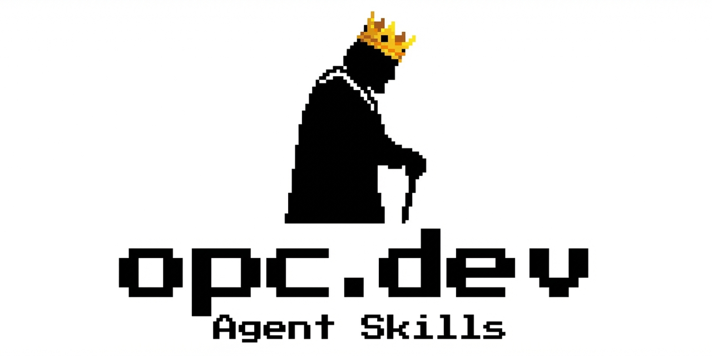

# OPC Skills

<p align="center">
  
</p>

<p align="center">
  <a href="https://opc.dev"></a>
  <a href="https://skills.sh/ReScienceLab/opc-skills"></a>
  <a href="https://github.com/ReScienceLab/opc-skills/blob/main/LICENSE"></a>
  <a href="https://github.com/ReScienceLab/opc-skills/stargazers"></a>
</p>

<p align="center">
  <a href="https://github.com/ReScienceLab/opc-skills/issues"></a>
  <a href="https://github.com/ReScienceLab/opc-skills/pulls"></a>
  
  <a href="https://github.com/ReScienceLab/opc-skills/graphs/contributors"></a>
</p>

<p align="center">
  <strong>AI Agent Skills for Solopreneurs, Indie Hackers, and One-Person Companies</strong>
</p>

<p align="center">
  Extend Claude Code, Cursor, Codex, and more with automation skills.<br>
  <a href="https://opc.dev">Browse Skills</a> · <a href="#quick-install">Quick Install</a> · <a href="#included-skills">View All Skills</a>
</p>

---

## What are Skills?

Skills are folders of instructions, scripts, and resources that AI agents load dynamically to improve performance on specialized tasks. Each skill is self-contained with a `SKILL.md` file containing instructions and metadata.

For more information about the Agent Skills standard, see [agentskills.io](http://agentskills.io).

## Included Skills

| | Skill | Description |
|:---:|-------|-------------|
|  | [requesthunt](./skills/requesthunt) | Research user demand from Reddit, X, and GitHub |
|  | [domain-hunter](./skills/domain-hunter) | Find domains, compare registrar prices, and discover promo codes |
|  | [logo-creator](./skills/logo-creator) | Create logos with AI, crop, remove background, export as SVG |
|  | [banner-creator](./skills/banner-creator) | Create banners for GitHub, Twitter, LinkedIn, etc. |
|  | [nanobanana](./skills/nanobanana) | Generate images using Gemini 3 Pro Image (Nano Banana Pro) |
|  | [reddit](./skills/reddit) | Search and retrieve content from Reddit via the public JSON API |
|  | [twitter](./skills/twitter) | Search and retrieve content from Twitter/X via twitterapi.io |
|  | [producthunt](./skills/producthunt) | Search Product Hunt posts, topics, users, and collections |
|  | [seo-geo](./skills/seo-geo) | SEO & GEO optimization for AI search engines (ChatGPT, Perplexity, Google) |

## Quick Install

Install with one command - works with Claude Code, Cursor, Windsurf, Droid, and 12+ other AI tools:

```bash
# Install all skills
npx skills add ReScienceLab/opc-skills

# Install specific skill
npx skills add ReScienceLab/opc-skills --skill reddit

# Install to specific agent
npx skills add ReScienceLab/opc-skills -a droid
```

Browse and discover skills at **[skills.sh](https://skills.sh/ReScienceLab/opc-skills)** 🎯

### Skills with Dependencies

Some skills require other skills to function properly:

- **domain-hunter** → requires `twitter` and `reddit`
- **logo-creator** → requires `nanobanana`
- **banner-creator** → requires `nanobanana`

Install them together:

```bash
npx skills add ReScienceLab/opc-skills --skill reddit --skill twitter --skill domain-hunter
```

---

## Supported AI Tools

OPC Skills work with 16+ AI coding agents via `npx skills add`:

- **Claude Code** - Desktop app for AI-assisted coding
- **Cursor** - AI-first code editor
- **Factory Droid** - AI software engineering agent
- **Windsurf** - AI-powered IDE
- **OpenCode** - Open-source AI coding assistant
- **Codex** - AI code generation tool
- **GitHub Copilot** - AI pair programmer
- **Gemini CLI** - Command-line AI assistant
- **Goose** - Terminal-based AI agent
- **Kilo Code** - Lightweight AI coding tool
- **Roo Code** - AI code assistant
- **Trae** - AI development companion
- **And more...**

See the [full compatibility list](https://github.com/vercel-labs/add-skill#available-agents) for all supported tools.

---

## Creating New Skills

See the template in `./template/` directory for the basic structure:

1. Create a folder in `skills/` with your skill name
2. Add a `SKILL.md` file with YAML frontmatter
3. (Optional) Add scripts, examples, or other resources

**Required fields in SKILL.md:**
```yaml
---
name: my-skill-name
description: A clear description of what this skill does and when to use it
---
```

For detailed guidance, check out existing skills or visit the [Agent Skills specification](https://agentskills.io/).

## Star History

[](https://star-history.com/#ReScienceLab/opc-skills&Date)

## Contributing

1. Fork this repository
2. Create a new skill folder in `skills/`
3. Add a `SKILL.md` with proper frontmatter
4. Submit a pull request

## License

Apache 2.0
